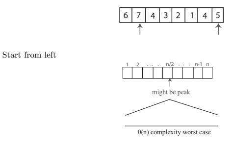
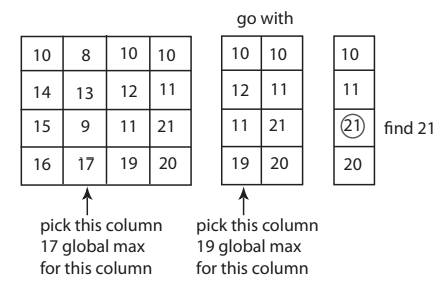

## Tìm điểm đỉnh nóc kịch trần
### Mảng 1D

Vị trí số 2 là đỉnh khi và chỉ khi b ≥ a và b ≥ c. Vị trí số 2 là đỉnh nếu i ≥ h.

Nhưng nếu bắt đầu từ $i=n/2$ thì sao (Ở đây thì n là độ dài của dãy số)

- If $a[n/2] < a[n/2 - 1]$ -> Tìm ở nửa bên trái 
- Else if $a[n/2] < a[n/2 + 1]$ thì ngược lại
- Nếu không n/2 là peak
    - $a[n/2] ≥ a[n/2 - 1]$
    - $a[n/2] ≥ a[n/2 + 1]$

Tìm độ phức tạp của thuật toán. Công thức này được cho trong ghi chú:

$T(n) = T(n/2) + Θ(1) = Θ(1) + . . . + Θ(1) (log2(n) times) = Θ(log2(n))$

### Mảng 2D

$a$ là điểm đỉnh của 2D khi $a ≥ b, a ≥ d, a ≥ c, a ≥ e$

Trong bài giảng thì thầy hướng dẫn bằng cách _đưa ra một ví dụ sai_ khi xử lý mảng 2D là chỉ so sánh mảng 1D nhưng chưa chạy hết trên các mảng 2D.

Đây là một giải pháp đúng:

- Chọn cột ở giữa mảng $j = m/2$
- Điểm lớn nhất trong cột $j => (i, j)$
- So sánh $(i, j − 1), (i, j), (i, j + 1)$
- Chọn cột bên trái nếu $(i, j − 1) > (i, j)$, tương tự cho cột bên phải
- $(i, j)$ là điểm đỉnh nóc kịch trần nếu hai điều kiện kia không còn thỏa mãn nữa. Tức là khi giải cho đến khi chỉ còn một cột thì số lớn nhất của cột cuối cùng cũng sẽ là peak của mảng 2D

$$
T(n, m) = T(n, m/2) + Θ(n) (to find global maximum on a column — (n rows))
T(n, m) = Θ(n) + . . . + Θ(n) ' -v " log m
= Θ(n log m) = Θ(n log n) if m = n
$$